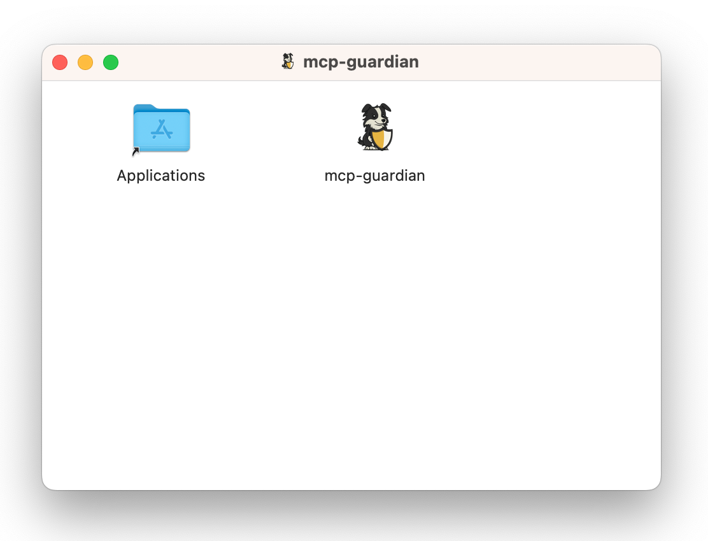
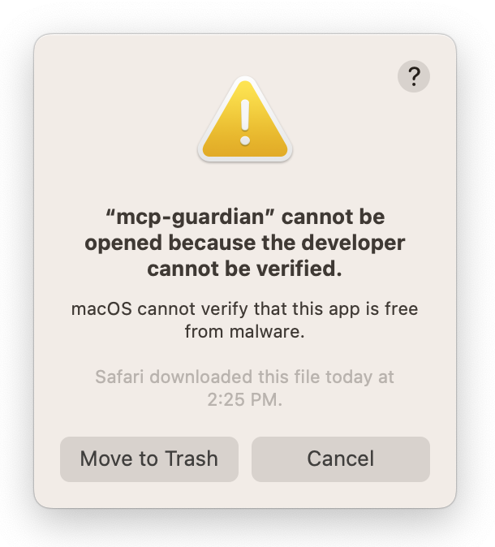
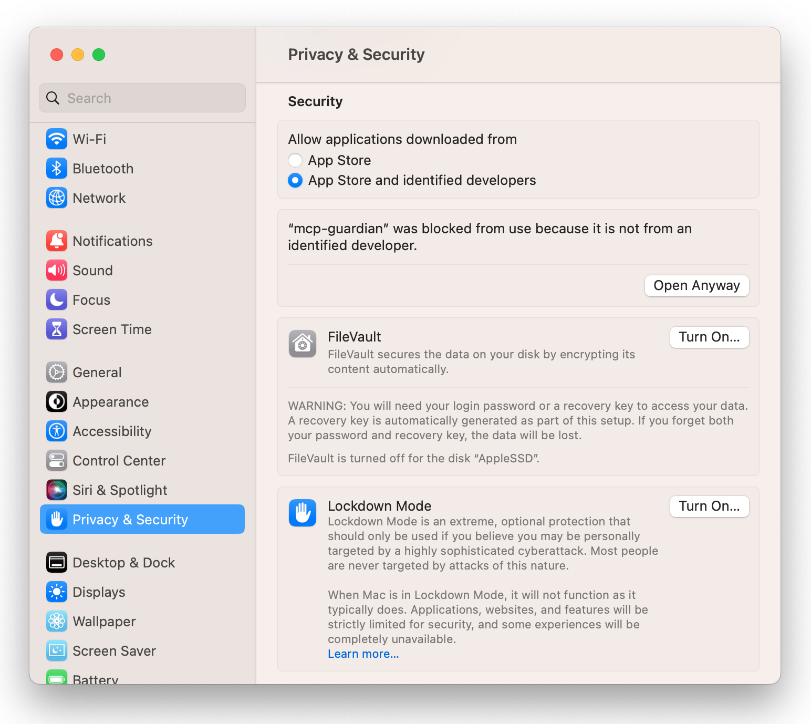
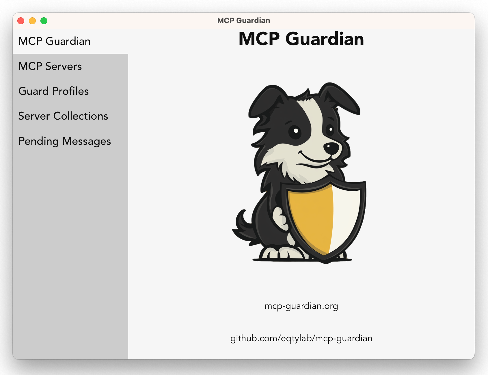

# Installing - macOS

MCP Guardian consists of two main parts; the proxy and a user interface for configuration. There are two user interfaces provided; a CLI and a desktop gui. The tutorials focus on the desktop gui, but you can do all the same configuration through the included CLI.

## Download  

Download the latest macOS .dmg package from [Github Releases](https://github.com/eqtylab/mcp-guardian/releases).

## Install GUI

From the finder, double-click the downloaded .dmg file. Then drag the MCP Guardian application into "Applications".



Now, from "Launchpad" try launching MCP Guardian. You should get a message about not being able to open the application because it's not verififed.



Open 'System Settings' and go to 'Privacy & Security' and scroll down to the 'Security' section. You will see a message saying `mcp-guardian` was blocked from use. Click "Open Anyway". You may have to enter your password. Then click "Open" to allow the installed MCP Guardian application to run on your machine.



The MCP Guardian GUI application should launch at this point.



## Install Proxy + CLI

`mcp-guardian-proxy` and `mcp-guardian-cli` binaries are both packaged with the GUI as "Resources" in the application package. In order to use these binaries more easily you'll want to copy them somewhere included in your `PATH`.

1. If it doesn't already exist, create `/usr/local/bin`
```bash
sudo mkdir /usr/local/bin
```

2. Copy binaries to `/usr/local/bin`
```bash
sudo cp /Applications/mcp-guardian.app/Contents/Resources/mcp-guardian-proxy /usr/local/bin/
sudo cp /Applications/mcp-guardian.app/Contents/Resources/mcp-guardian-cli /usr/local/bin/
```

3. Make sure binaries are executible
```bash
chmod +x /usr/local/bin/mcp-guardian-proxy
chmod +x /usr/local/bin/mcp-guardian-cli
```

4. Try to run `mcp-guardian-proxy`
```bash
mcp-guardian-proxy --help
```

5. If you get a message about not being able to run `mcp-guardian-proxy` instead of the `--help` output, follow the same steps as were done for the GUI application to enable the binary from 'System Settings' -> 'Privacy & Security' -> 'Security'. You can also do the same for `mcp-guardian-cli` if you would like to use the cli interface instead of the GUI application for configuring MCP Guardian.

<br/>

MCP Guardian is now installed. Check out the intro and tutorials to start using MCP Guardian with Claude Desktop.
