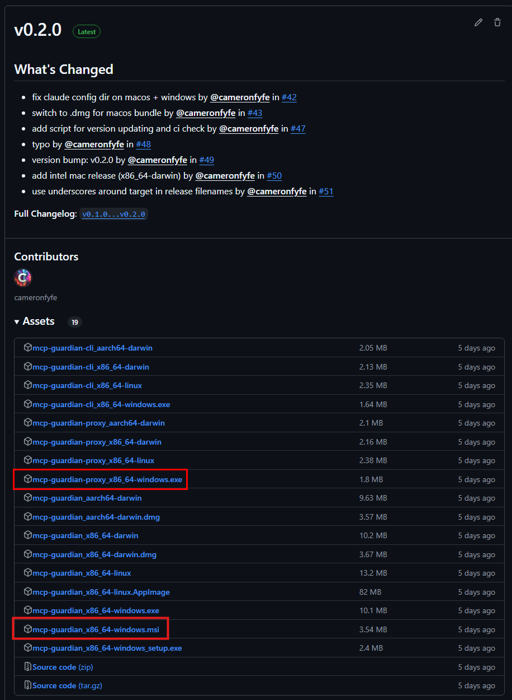

# Installing - Windows

# Download  

Download the the latest Windows msi installer release from [github](https://github.com/eqtylab/mcp-guardian/releases)

> you may need to show all assets to find the installer.

# Install 
After the download completes, open the File Explorer and navigate to the folder where the msi was downloaded.  
Right click on the msi and select `Properties`

In the properties window that opens, check the `Unblock` checkbox on the General Tab in the Security section; and then click `Apply`.  

Now close the Properties window and double click the msi file to launch the installer. 

Click the `Next` button, accepting all defaults, then click `Install`. You'll get a prompt from the User Account Control asking for permission to make changes to your device; select `Yes`

After the installer completes, click `Finish` and the MCP Guardian UI will launch automatically.