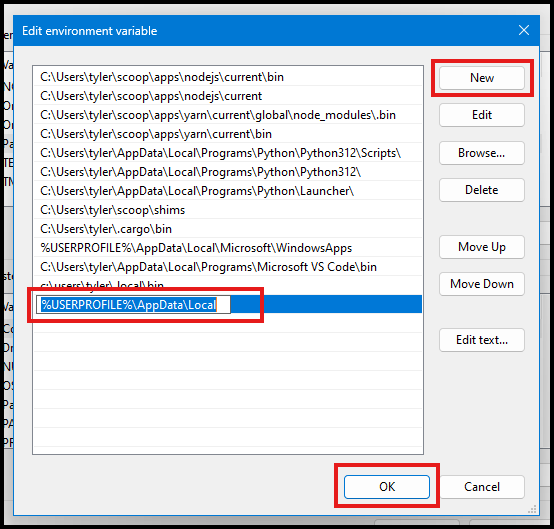

# Installing - Windows
MCP Guardian consists of two main parts; the proxy and a user interface for configuration. There are two user interfaces provided; a CLI and a desktop gui. This doc will go through installing the gui, but you can do all the same configuration through the CLI.

# Download  

Download the the latest Windows msi installer release for the GUI and the proxy executable from [github](https://github.com/eqtylab/mcp-guardian/releases)


> You may need to show all assets to find the installer.  


# Install 
## Install - GUI
After the downloads complete, open the File Explorer and navigate to the download folder.  
1. Right click the msi file and select `Properties`  


2. In the properties window that opens, check the `Unblock` checkbox on the General Tab in the Security section; and then click `Apply`.  


3. Double click the msi file to launch the installer.   


4. Click the `Next` button, accepting all defaults, then click `Install`. You'll get a prompt from the User Account Control asking for permission to make changes to your device; select `Yes`  


After the installer completes, click `Finish` and the MCP Guardian UI will launch automatically.

## Install - Proxy
* Move the proxy executable file to you local appdata folder.  
> To find your appdata folder:  
> In PowerShell ```sh echo  $env:LOCALAPPDATA```  
> In command prompt ```sh echo %LOCALAPPDATA%```  

* Rename the exe to `mcp-guardian-proxy.exe`

* Add the exe to your path to make it easier to call from anywhere on your system:  
1. Open the Start Menu and search for "Environment Variables" and select "Edit the system environment variables".  

2. In the System Properties window, click on the "Environment Variables" button.  

3. In the Environment Variables window, find the "Path" variable in the "System variables" section and select it, then click "Edit".

4. In the Edit Environment Variable window, click "New" and add `%USERPROFILE%\AppData\Local`  

5. Click `Apply` or `Ok` in each of those windows to close them 

* Open a PowerShell shell and run ```sh mcp-guardian-proxy --help``` and you should see output like this:  


MCP Guardian is now installed. Check out the intro and tutorials to start using MCP Guardian with Claude Desktop.