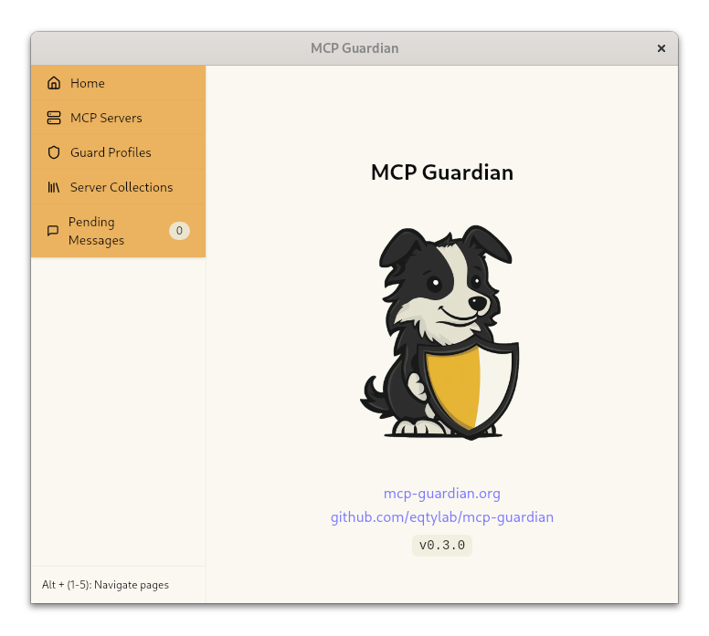

# Introduction

MCP Guardian manages your LLM assistant's access to MCP servers, handing you realtime control of your LLM's activity.

 

**📜 Message Logging** - See traces for all of an LLM's MCP server activity

**💂 Message Approvals** - Approve and deny individual tool call messages in real time

**🤖 Automated Message Scans** - Realtime automated checks for safety, privacy, etc (Coming Soon)

MCP Guardian also makes it a breeze to manage multiple MCP server configurations. Quickly switch between server collections without having to manually manage configuration files for your MCP host applications.

 

 

MCP Guardian leverages [Model Context Protocol](https://github.com/modelcontextprotocol), an open protocol for communication between LLM applications and external data/tool providers. [Claude Desktop](https://claude.ai/download) as well as [many useful MCP servers](https://github.com/modelcontextprotocol/servers?tab=readme-ov-file#-reference-servers) currently support the protocol.

 

Because MCP is an open specification, MCP Guardian doesn't need to be deeply integrated in an LLM's host application to manage its activity. It simply proxies MCP traffic from an existing host (like Claude Desktop) to provide visibility and granular control of the LLM's activity.
