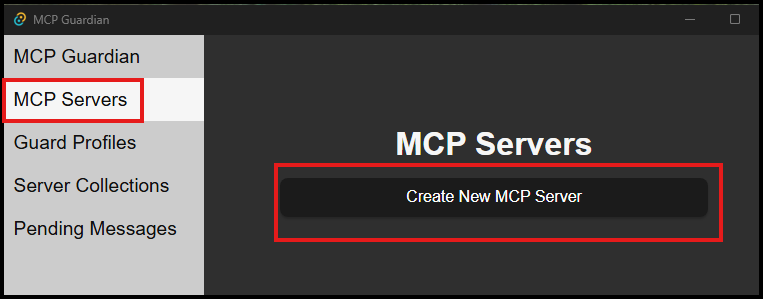

# Create an MCP Server
## GUI 
Launch the MCP Guardian UI if it's not already running.  
Select the `MCP Servers` tab, then click the `Create New MCP Server` button.  
  
The `Create MCP Server` window has three fields:
1. Namespace - This is used for grouping/organizing server configurations. It can be any value you want except `mcp-guardian`
2. Name - The user friendly name to give the server.
3. Config - The JSON configuration for launching the MCP server. Dozens of servers are available from https://github.com/modelcontextprotocol/servers

For this tutorial enter the following values:  
Namespace - `tutorial`  
Name - `time-server`  
Config -
```json
{
  "command": "uvx",
  "args": ["mcp-server-time", "--local-timezone=America/New_York"],
  "env": {}
}
```
> If you don't have uvx installed, docker and pipx configurations are available [here](https://github.com/modelcontextprotocol/servers/tree/main/src/time)  

Then click `Save`  
</br>
## CLI
TODO
