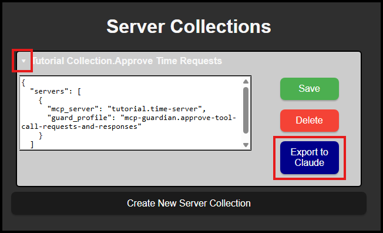
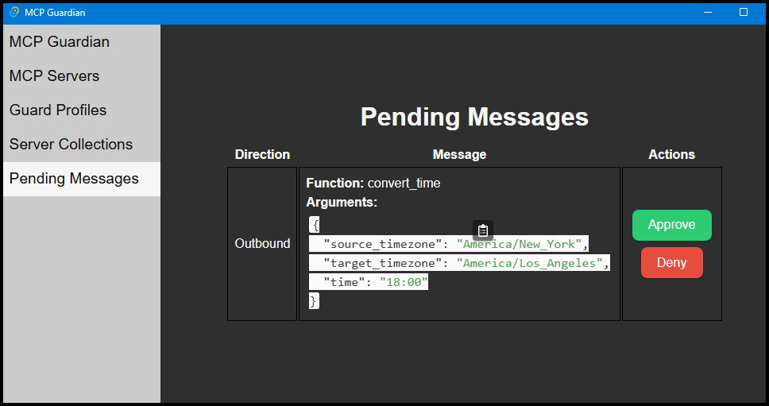

# Create Server Collection
A server collection combines the functionality of an MCP server with the protections of a Guard Profile. The collection creates a claude configuration and imports it directly to Claude.  

This doc assumes you created the Time server as defined in the [create mcp server doc](./create_mcp_server.md). If you want to use a different server, make sure to use the namespace and name for that server.  

From the Serer Collections tab, click the `Create New Server Collection` button.  
  
The collection needs a namespace, and name. These can be different from the name and namespace you used for the MCP Server and Guard Profile. For this tutorial we'll use:
* Namespace - `Tutorial Collection`
* Name - `Approve Time Requests`
* Config - 
```json
{
  "servers": [
    {
      "mcp_server": "tutorial.time-server",
      "guard_profile": "mcp-guardian.approve-tool-call-requests-and-responses"
    }
  ]
}
```

> The `mcp_server` and `guard_profile` must be in the format `<NAMESPACE>.<NAME>` and must match the server and guard profile you have defined.  

Click `Create` and you'll see your new server collection in the list.  

Expand the server collection, and then click the `Export to Claude` button.  


> If you didn't add the `mcp-guardian-proxy` to your system path, you can specify the fullpath to start the proxy now.  

Click the `Apply to Claude Desktop` then open the `Pending Messages` tab

> If Claude was already running, you'll need to exit and restart it for the configuration to take affect.  

After Claude restarts, make sure the MCP Guardian UI is visble along side Claude, then ask Claude ```If its 6 pm in New York, what time is it in```.  

Claude will begin process your prompt, then attempt to communicate with the mcp-server-time through the MCP Guardian Proxy. Claude's communication with the server is visible in the Pending Messages, along with the server function it is trying to call and the data it wants to pass to the server.  This gives you the opportunity to inspect the data and stop it from being sent to the server.   
Similarly, the servers response is visible in the GUI and again, you can prevent the data from being sent back to Claude if you choose.  
> If a pending message isn't approved soon enough, Claude will eventually time out and the prompt will fail.

